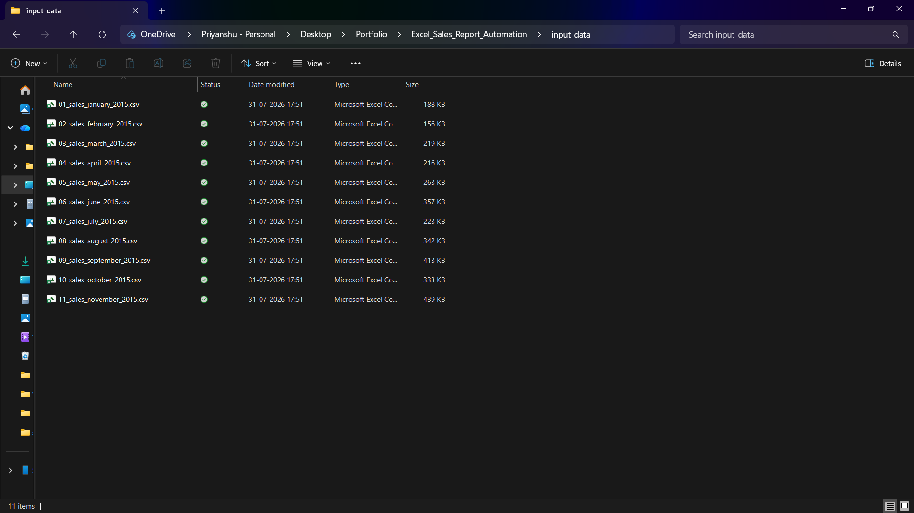
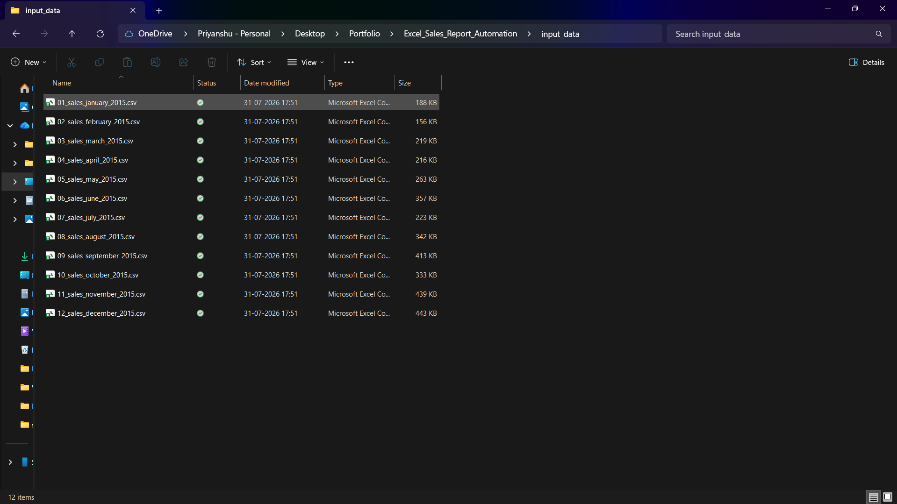
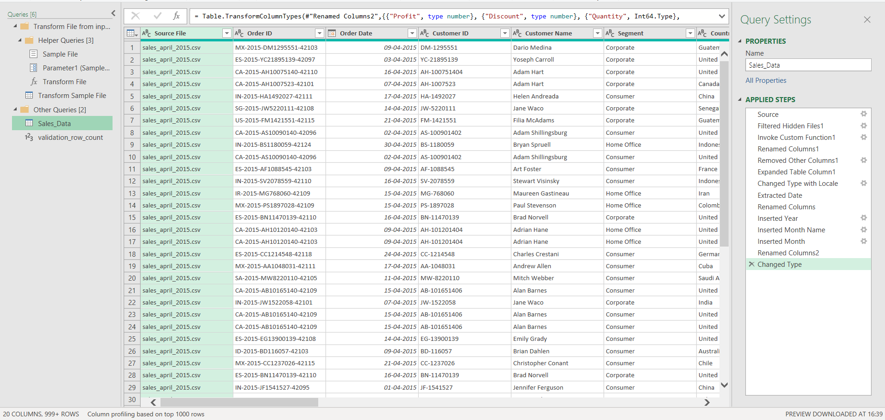
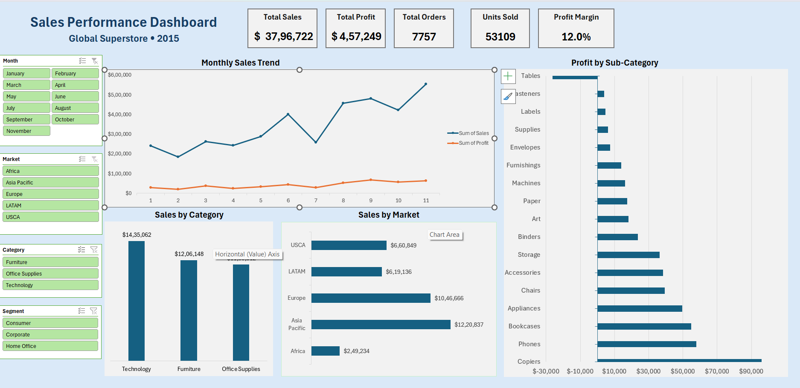
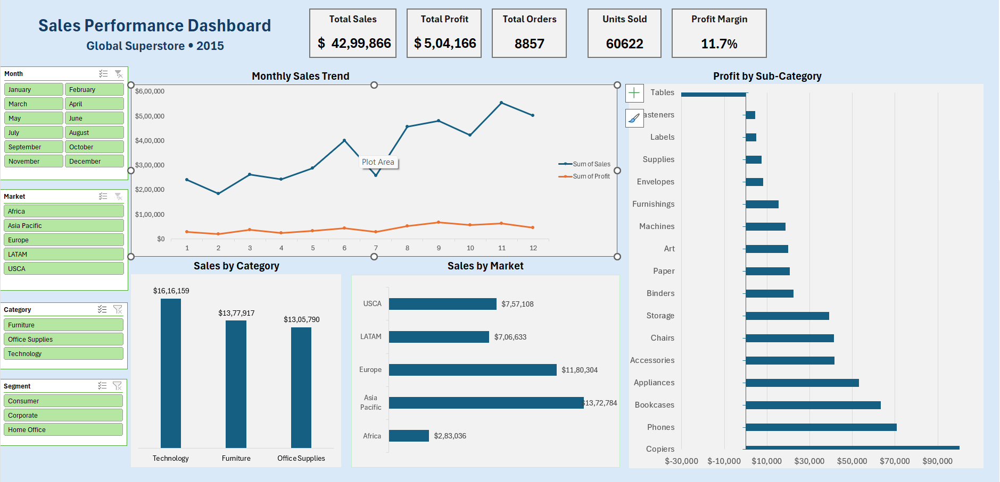
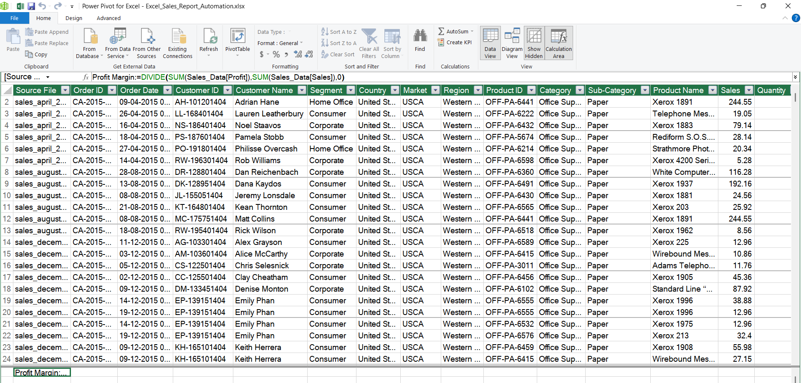

# 📊 Excel Sales Report Automation Dashboard

An end-to-end Excel reporting solution that automatically consolidates **12 monthly sales CSV files containing 8,857 sales transactions** using **Power Query**, loads them into a **Power Pivot Data Model**, calculates KPIs with **DAX**, and updates an interactive dashboard with a single click.


---

# 📌 Business Problem & Solution

Many organizations receive sales data as separate monthly CSV files. Manually combining files, updating PivotTables, recalculating KPIs, and rebuilding reports every month is repetitive, time-consuming, and prone to errors.

This project automates the complete reporting workflow by consolidating **12 monthly CSV files (8,857 sales transactions)** into a centralized reporting model using **Power Query**, **Power Pivot**, and **DAX**.

With a single **Refresh All**, Excel automatically:

- Detects new monthly CSV files
- Imports and transforms the data
- Refreshes the Data Model
- Recalculates DAX measures
- Updates PivotTables and PivotCharts
- Refreshes KPI cards and interactive dashboard visuals

No manual copy-pasting or report rebuilding is required.

---

# 🚀 Features

- 📂 Automatic Folder Import using Power Query
- 🔄 Automated ETL (Extract, Transform, Load) pipeline
- 📊 Power Pivot Data Model
- 📐 DAX Measures for KPI calculations
- 📈 Interactive KPI Dashboard
- 🎛 Dynamic slicers for filtering
- 📅 Monthly Sales Trend
- 🏷 Sales by Category
- 🌍 Sales by Market
- 💰 Profit by Sub-Category
- ⚡ One-click monthly reporting refresh

---

# 🛠 Tools & Technologies

- Microsoft Excel
- Power Query
- Power Pivot
- DAX
- Pivot Tables
- Pivot Charts
- Slicers

---

# 📊 Dashboard Preview

The dashboard provides an executive-level overview of sales performance through interactive KPIs and visualizations.


### Dashboard Includes

- Total Sales
- Total Profit
- Total Orders
- Units Sold
- Profit Margin
- Monthly Sales Trend
- Sales by Category
- Sales by Market
- Profit by Sub-Category
- Interactive Month, Market, Category, and Segment slicers

---

# ⚙️ Automation Workflow

```text
Monthly CSV Files
        │
        ▼
Power Query Folder Import
        │
        ▼
Data Cleaning & Transformation
        │
        ▼
Power Pivot Data Model
        │
        ▼
DAX Measures
        │
        ▼
Pivot Tables & Pivot Charts
        │
        ▼
Interactive Dashboard
```

---

# 🔄 Automation Demonstration

The dashboard was initially built using **January–November 2015** sales data.

---

## Step 1 — Initial Input Folder

Only January through November CSV files exist inside the input folder.



---

## Step 2 — Add December Sales File

A new monthly CSV is simply copied into the folder.

No Power Query modifications or manual data consolidation are required.



---

## Step 3 — Power Query ETL Pipeline

Power Query automatically:

- Detects every CSV inside the folder
- Combines all files into one dataset
- Applies data transformations
- Creates Year and Month fields
- Loads the cleaned data into the Power Pivot Data Model



---

## Step 4 — Dashboard Before Refresh

Before refreshing, the dashboard only contains January–November data.



---

## Step 5 — Refresh All

Click:

**Data → Refresh All**

Excel automatically:

- Imports the December CSV
- Refreshes Power Query
- Updates the Power Pivot Data Model
- Recalculates DAX measures
- Refreshes PivotTables
- Updates PivotCharts
- Refreshes KPI cards
- Adds December to the Month slicer

---

## Step 6 — Dashboard After Refresh

The entire dashboard updates automatically.

Notice that:

- KPIs increase automatically
- December appears in the Month slicer
- Trend chart updates
- Every PivotTable and PivotChart refreshes without manual intervention



---

# 📈 Power Pivot & DAX

The analytical model is built using **Power Pivot**, with DAX measures used to calculate KPIs.

Example DAX measure:

```DAX
Profit Margin :=
DIVIDE(
    SUM(Sales_Data[Profit]),
    SUM(Sales_Data[Sales]),
    0
)
```



---

# 📂 Project Structure

```text
excel-sales-report-automation/
│
├── Excel_Sales_Report_Automation.xlsx
├── README.md
├── LICENSE
├── .gitignore
│
├── input_data/
│   ├── 01_sales_january_2015.csv
│   ├── 02_sales_february_2015.csv
│   ├── ...
│   └── 12_sales_december_2015.csv
│
└── screenshots/
    ├── dashboard.png
    ├── dashboard_initial.png
    ├── dashboard_refreshed.png
    ├── input_folder_initial.png
    ├── input_folder_updated.png
    ├── power_query_etl.png
    └── power_pivot_dax.png
```

---

# ▶️ How to Use

1. Clone or download this repository.
2. Open **Excel_Sales_Report_Automation.xlsx**.
3. Ensure the monthly CSV files are located inside the **input_data** folder.
4. If prompted, update the **Power Query Source** folder path to match your local `input_data` directory.
5. Click **Data → Refresh All**.
6. The dashboard automatically updates with the latest available sales data.

> **Note:** Power Query stores an absolute folder path. After downloading the project, you may need to update the **Source** step once to point to your local `input_data` folder.

---

# 💡 Skills Demonstrated

- Power Query Folder Import
- ETL (Extract, Transform, Load)
- Data Cleaning & Transformation
- Power Pivot Data Modeling
- DAX Measures
- KPI Dashboard Design
- Pivot Tables
- Pivot Charts
- Interactive Reporting
- Reporting Automation
- Business Data Visualization

---

# 🚀 Future Improvements

Potential enhancements include:

- Dynamic multi-year reporting
- Geographic sales dashboard
- Product-level drill-down analysis
- Customer segmentation dashboard
- Sales forecasting
- Power BI implementation

---

# 📄 Dataset

**Dataset:** [Global Superstore Sales Dataset]((https://huggingface.co/spaces/SHAILJA1/ETL/blob/main/global_superstore_2016%20%281%29.xlsx?utm_source=chatgpt.com))

This project uses the Global Superstore dataset for educational and portfolio purposes.

---

# 📜 License

This project is intended for educational and portfolio purposes.
